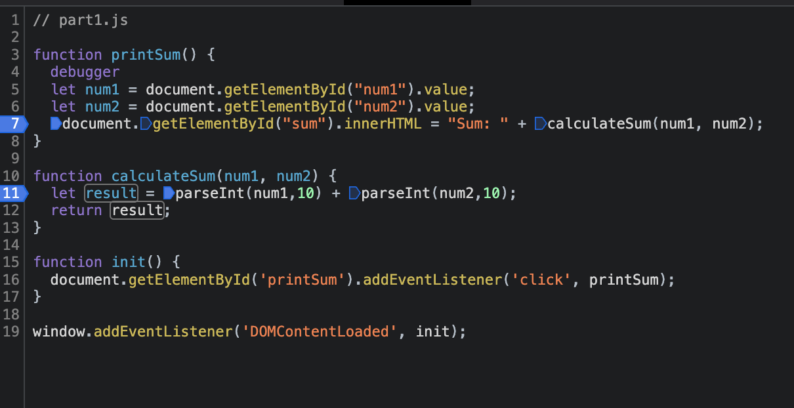

# Part 3 Solutions Continued

1. The bug was that `num1` and `num2` were string values and that `result` was the concatenation of the two. Instead, `num1` and `num2` needed to be converted to number data types before being added together for the correct result.
   
2. I fixed it by using `parseInt()` to convert `string` values to `integer` values. 

